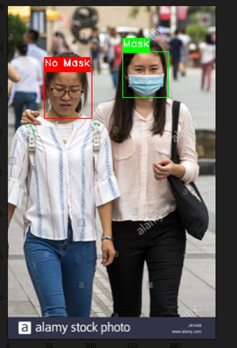

# Face Mask Detection Project 

## Overview

This project aims to detect whether individuals are wearing face masks in images or live video streams. It addresses the need for enforcing safety measures during the COVID-19 pandemic and beyond.

## Key Components

- **Dataset:** The project uses a dataset containing images of people with and without face masks.

- **Model:** We employ VGG-19 deep learning model and Haar Cascade Classifier for face mask detection.

## Usage

Run the model on images to detect face mask usage.

## Acknowledgments

We appreciate the open-source community for providing valuable resources and libraries for computer vision and deep learning.

## Outputs

